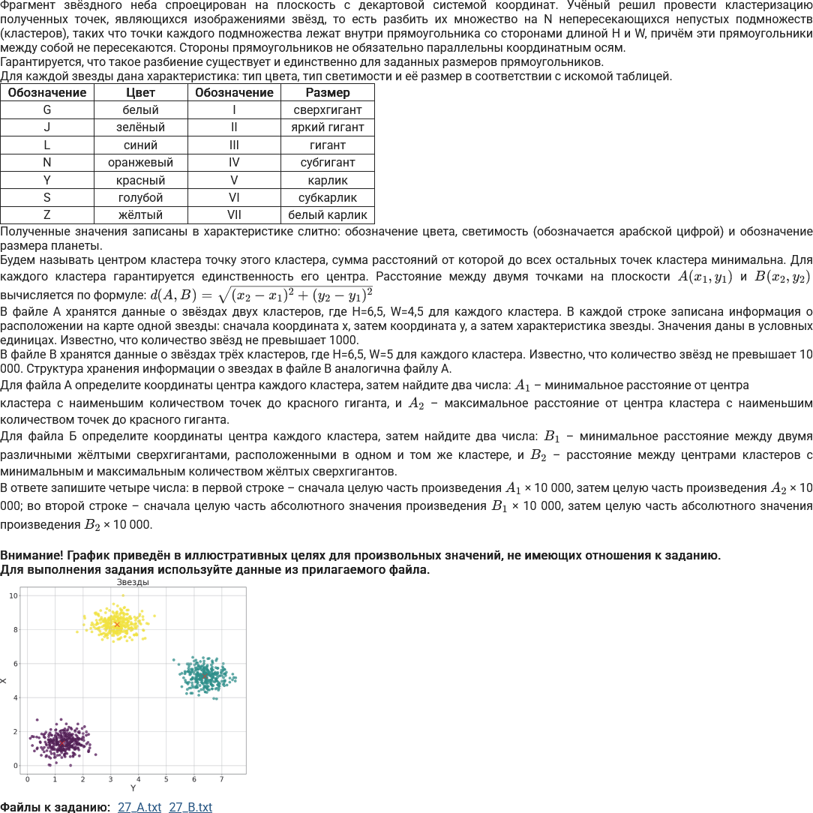
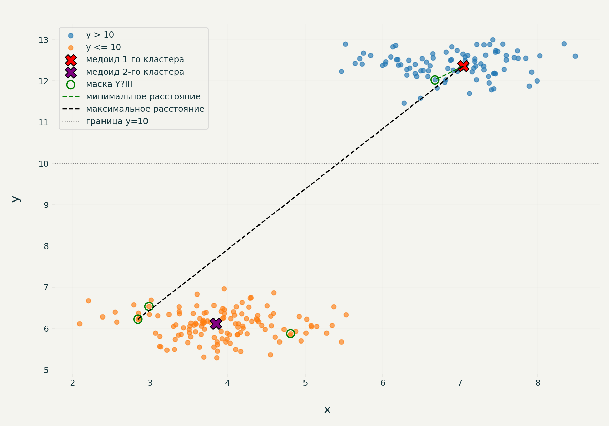
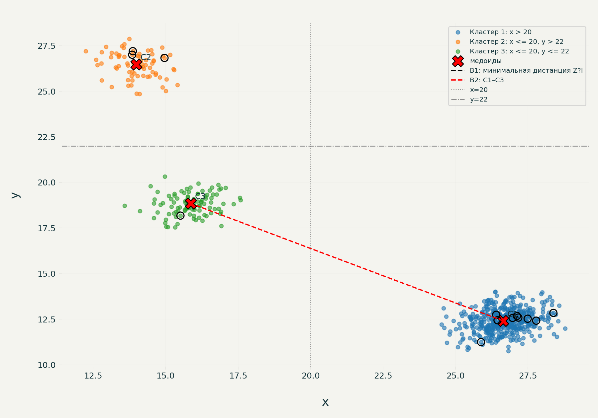

# Решение задач A и B (задание 27)

## Условие задачи



## Графики

### Задача A



**Описание:**
- Синие точки: кластер \(y > 10\)
- Оранжевые точки: кластер \(y \le 10\)
- Красный и фиолетовый крестики: медоиды кластеров
- Зелёные окружности: точки с маской `Y?III`
- Зелёный пунктир: минимальное расстояние от медоида первого кластера до точек `Y?III`
- Чёрный пунктир: максимальное расстояние от медоида первого кластера до точек `Y?III`
- Серая пунктирная линия: граница \(y = 10\)

### Задача B



**Описание:**
- Синие точки: кластер \(x > 20\)
- Оранжевые точки: кластер \(x \le 20,\ y > 22\)
- Зелёные точки: кластер \(x \le 20,\ y \le 22\)
- Красные крестики: медоиды кластеров (C1, C2, C3)
- Чёрные окружности: точки с маской `Z?I`
- Чёрный пунктир: минимальное расстояние \(B_1\) между точками `Z?I` внутри одного кластера
- Красный пунктир: расстояние \(B_2\) между медоидами C1 и C3
- Серые линии: границы \(x = 20\) и \(y = 22\)

## Решения на Python

### Задача A

Файл: `e27_28766_A.py`

```python
from math import dist
from fnmatch import fnmatch

with open("27_A.txt") as f:
    p = [[float(x), float(y), v] for x, y, v in
         (s.replace(",", ".").split() for s in f)]

c = [[p for p in p if p[1] > 10],
     [p for p in p if p[1] <= 10]]

centers = [
    min(cluster, key=lambda q:
        sum(dist(q[:2], p[:2]) for p in cluster))
    for cluster in c
]

d = [dist(centers[0][:2], p[:2])
     for p in p if fnmatch(p[2], "Y?III")]

a1 = int(min(d) * 10000)
a2 = int(max(d) * 10000)

print(a1, a2)
```

**Краткое описание алгоритма:**
1. Считать все точки из файла `27_A.txt`.
2. Разделить точки на два кластера по условию \(y > 10\) / \(y \le 10\).
3. Для каждого кластера найти медоид — точку, минимизирующую сумму расстояний до всех точек кластера.
4. Отобрать точки, чей идентификатор подходит под маску `Y?III`.
5. Вычислить расстояния от медоида первого кластера до этих точек.
6. Вывести целые части минимального и максимального расстояний, умноженных на 10000.

### Задача B

Файл: `e27_28766_B.py`

```python
from math import dist
from fnmatch import fnmatch

with open("27_B.txt") as f:
    p = [[float(x), float(y), v] for x, y, v in
         (s.replace(",", ".").split() for s in f)]

c = [
    [p for p in p if p[0] > 20],
    [p for p in p if p[0] <= 20 and p[1] > 22],
    [p for p in p if p[0] <= 20 and p[1] <= 22]
]

centers = [
    min(cluster, key=lambda q:
        sum(dist(q[:2], p[:2]) for p in cluster))
    for cluster in c
]

z = [
    [p[:2] for p in cluster if fnmatch(p[2], "Z?I")]
    for cluster in c
]

d = [
    dist(a, b)
    for cluster in z
    for a in cluster
    for b in cluster
    if a != b
]

b1=int(abs(min(d) * 10000))
b2=int(abs(dist(centers[0][:2], centers[2][:2]) * 10000))

print(b1, b2)
```

**Краткое описание алгоритма:**
1. Считать все точки из файла `27_B.txt`.
2. Разделить точки на три кластера:
   - \(x > 20\);
   - \(x \le 20,\ y > 22\);
   - \(x \le 20,\ y \le 22\).
3. Для каждого кластера найти медоид.
4. Отобрать точки с идентификаторами, подходящими под маску `Z?I`, внутри каждого кластера.
5. Найти минимальное расстояние \(B_1\) между парой таких точек внутри одного кластера.
6. Вычислить расстояние \(B_2\) между медоидами первого и третьего кластеров.
7. Вывести целые части абсолютных значений \(B_1 \cdot 10000\) и \(B_2 \cdot 10000\).

## Файлы

- `problem_statement.png` — изображение условия задачи.
- `plot_A.png` — график для задачи A.
- `plot_B.png` — график для задачи B.
- `27_A.txt`, `27_B.txt` — входные данные.
- `e27_28766_A.py` — код решения задачи A.
- `e27_28766_B.py` — код решения задачи B.